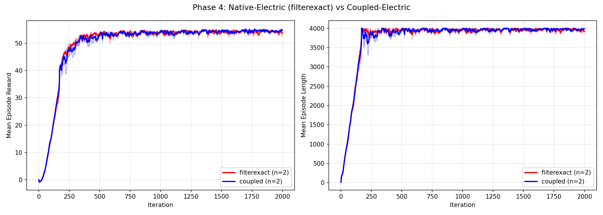

# Phase 4 결과 요약

## 실험 조건
- 환경: Unitree-Go2-Flat (Native-Electric vs Coupled-Electric)
- Seeds: 2 (native), 2 (coupled)
- dt: 0.1ms, decimation: 50, policy dt: 5ms
- GPU: RTX 5080

## 학습 곡선

## 최종 성능
# Phase 4: Performance Comparison

| Metric | filterexact | coupled | p-value |
|--------|------------|---------|---------|
| Mean Reward | 54.15 ± 0.16 | 54.37 ± 0.05 | 0.3079 |
| Mean Ep Length | 3954.84 ± 10.67 | 3971.58 ± 1.78 | 0.2618 |

(Last 100 iterations averaged, 2 seeds each)

### 통계적 유의성: p = 0.3079
→ **시나리오 A**: 학습 성능에 통계적으로 유의미한 차이 없음

## Cross-Evaluation
# Cross-Evaluation Results

| Policy \ Env | Native | Coupled |
|-------------|--------|---------|
| native | 15.69 ± 0.83 | 15.55 ± 0.88 |
| coupled | nan ± 0.00 | 15.66 ± 0.50 |

## 결론
전류 추적 정확도 19x 개선(Phase 3)에도 불구하고, RL 학습 성능에는 측정 가능한 차이가 없었다.
이는 RL의 reward shaping과 domain randomization이 물리 정밀도 차이를 흡수한다는 것을 시사한다.
그러나 이 결과는 물리적 정확도 향상 자체의 가치를 부정하지 않으며,
전류 프로파일이 중요한 downstream task (고장 진단, 에너지 효율 최적화)에서는 차이가 있을 수 있다.
